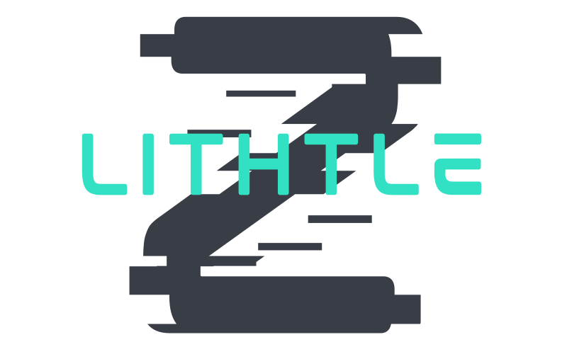

&nbsp;

---

&nbsp;

 
 

<h1 align="justify">Criador de personagens</h1>
<h2 align="justify">Feito por : Thiago Zambelli</h2>
<h3 align="justify">Projeto feito para treinar React com TypeScript </h3>
 
  

- [Projeto](#projeto)
- [Problemas e Soluções](#problemas__solucoes)

&nbsp;

---

# Projeto -> 

> O projeto consiste na ideia de criar uma aplicação para desenvolver personagens de RPG que futuramente se ligara a outro que ira renderizar a ficha.

## Criação do projeto ->
> O Projeto foi criado com o comando `npx create-react-app --template typescript react-typescript --use-npm`, onde o `create-react-app` criou a base do projeto, `--template typescript react-typescript` setou o tamplate de typescript e o `--use-npm` setou o npm como padrao do projeto.

## Recoil ->
> Com o comando `npm i recoil` foi intalado o React Recoil, que servira para lidar com os estados globais da aplicação.

## React-Icons->
> Com o comando `npm i react-icons` foi instalado o pacote de icones que sera usado no projeto.

## React-router-dom ->
> Com o comando `npm i react-router-dom`, foi instalado o Router Dom, para lidar com o sistema de SPA e controle de rotas.

## SASS ->
> Com o comando `npm i SASS`, foi configurado o SASS para a sua utilização durante o desenvolvimento do projeto.

## Normalize ->
> Com o comando `npm install --save normalize.css` e posteriormente sua importação no index do projeto, foi intalado o reset.css utilizado na aplicação, o Normalize.

> Projeto cridao em React/TypeScript para ser um criador de personagem de RPG. Este projeto ira contar com formularios para a criação de um personagem e futuramente sera ligado a outro projeto que ira renderizar a ficha de RPG basedao no personagem criado aqui.